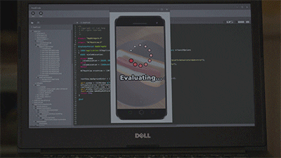

<h1>Yaren&nbsp;Akın</h1>

<i>Software Engineer&nbsp;&nbsp;·&nbsp;&nbsp;Full Stack</i>

İstanbul, Türkiye

 

I build backend services and desktop applications, and I have been working across the
C++ and C# ecosystems since 2021. I enjoy owning both sides of a product — the services
underneath and the interface people actually touch.

Right now I am a **Specialist Software Engineer at A101**, working end to end on
a platform, the platform that runs store operations across a nationwide retail network.
I develop its .NET backend services and Angular frontend: store reporting, user and
permission management, payment and checkout flows, and POS integrations.

Before that, at **Armada Yazılım**, I built a Qt&nbsp;6 / C++ / VTK desktop 3D editor for a
dental CAD/CAM product family, then compiled the same C++17 codebase to WebAssembly with
Emscripten to turn it into a mesh editor that runs in the browser at near-native speed.

 

· · ·

 

### Teknolojiler

<table>
<tr>
<td valign="middle" width="130"><b>Diller</b></td>
<td>
&nbsp;
&nbsp;
&nbsp;
&nbsp;
&nbsp;

</td>
</tr>
<tr>
<td valign="middle"><b>Backend</b></td>
<td>
&nbsp;
&nbsp;
&nbsp;

</td>
</tr>
<tr>
<td valign="middle"><b>Frontend</b></td>
<td>
&nbsp;
&nbsp;
&nbsp;

</td>
</tr>
<tr>
<td valign="middle"><b>Grafik &amp; 3B</b></td>
<td>
&nbsp;
&nbsp;

</td>
</tr>
<tr>
<td valign="middle"><b>Araçlar</b></td>
<td>
&nbsp;
&nbsp;
&nbsp;
&nbsp;

</td>
</tr>
</table>

 

### Biraz da

🥇&nbsp; Teknofest 2018 Su Altı Sistemleri — Türkiye birincisi (ROV takımı)&nbsp;&nbsp;·&nbsp;&nbsp;
🎓&nbsp; KTÜ, Elektrik-Elektronik Mühendisliği&nbsp;&nbsp;·&nbsp;&nbsp;
🎧&nbsp; Udemy'de OpenCV &amp; C++ eğitim içeriği

 
 

 
 

